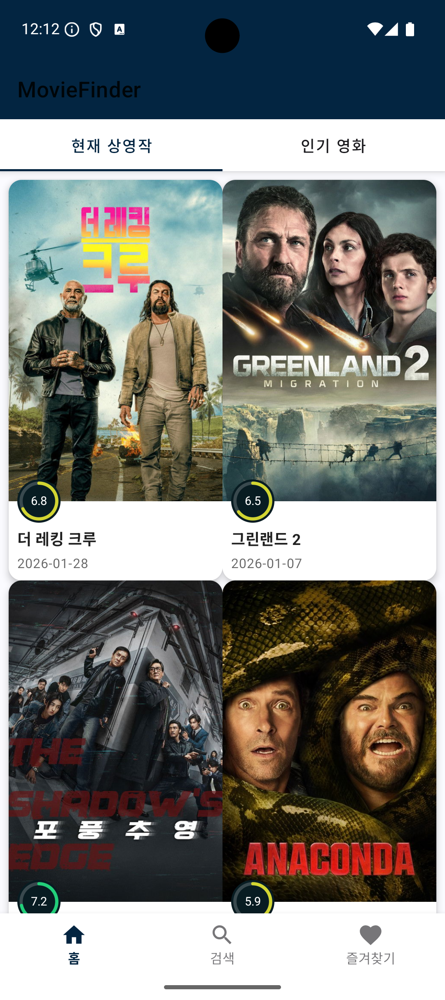
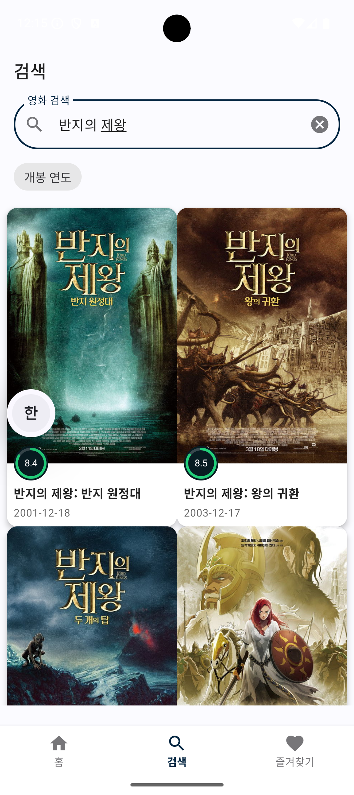
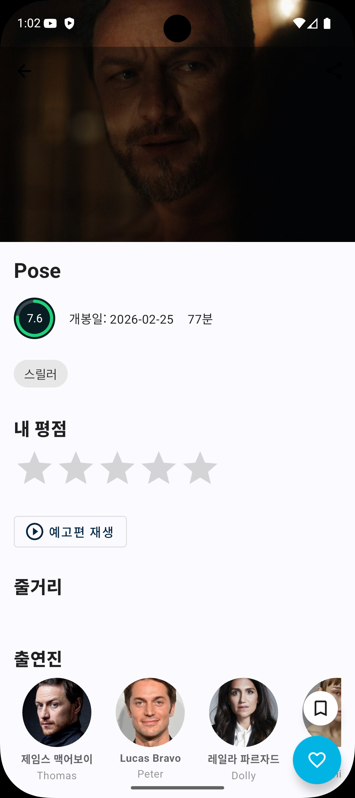
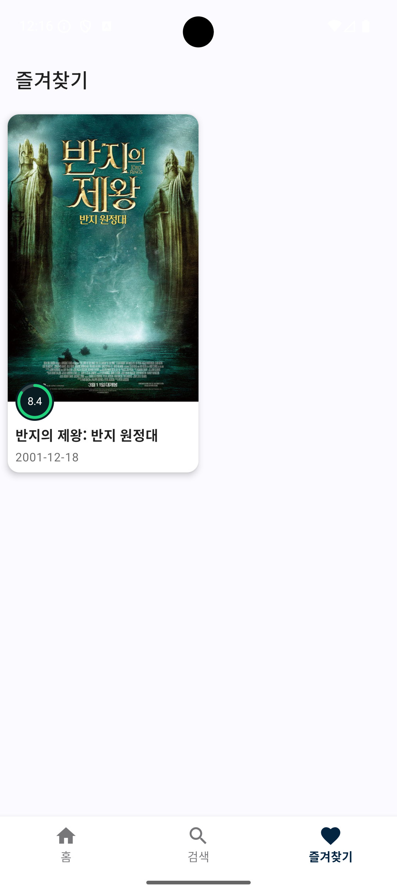

# MovieFinder

TMDB API를 활용한 영화 검색 Android 앱

## Screenshots

| Home | Search | Detail | Favorite |
|:----:|:------:|:------:|:--------:|
|  |  |  |  |

## Features

- **영화 탐색** - 현재 상영작 / 인기 영화 무한 스크롤
- **영화 검색** - 실시간 검색 + 연도 필터
- **영화 상세** - 줄거리, 출연진, 비슷한 영화, 예고편 재생
- **즐겨찾기** - 로컬 저장 + 스와이프 삭제
- **오프라인 지원** - 네트워크 없이도 캐시된 데이터 표시
- **네트워크 모니터링** - 실시간 온/오프라인 감지 및 알림
- **다크 모드** - 시스템 테마 자동 대응

## Tech Stack

| Category | Stack |
|----------|-------|
| Language | Kotlin |
| UI | XML Layouts, ViewBinding, Material Components |
| Architecture | Clean Architecture, MVVM |
| DI | Hilt |
| Network | Retrofit, OkHttp, kotlinx.serialization |
| Database | Room |
| Async | Coroutines, Flow |
| Paging | Paging 3, RemoteMediator |
| Image | Coil |
| Navigation | Navigation Component, Safe Args |
| Test | JUnit 4, MockK, Turbine |

## Architecture

```
app/
├── core/           # 공유 유틸리티
├── data/           # Repository 구현, API, Room DB
├── domain/         # UseCase, Repository 인터페이스, Model
├── presentation/   # Fragment, ViewModel, Adapter
└── di/             # Hilt 모듈
```

## Setup

1. [TMDB](https://www.themoviedb.org/settings/api)에서 API 키 발급

2. `local.properties`에 추가:
```properties
TMDB_API_KEY=your_api_key_here
```

3. 빌드:
```bash
./gradlew assembleDebug
```

## Requirements

- Android Studio (AGP 9.0.0+)
- JDK 21+
- minSdk 24 / targetSdk 36

## License

MIT License
