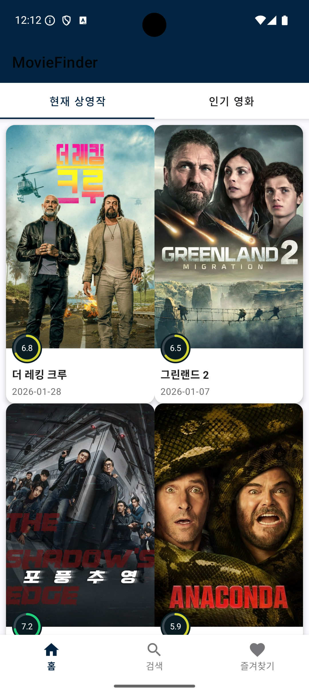
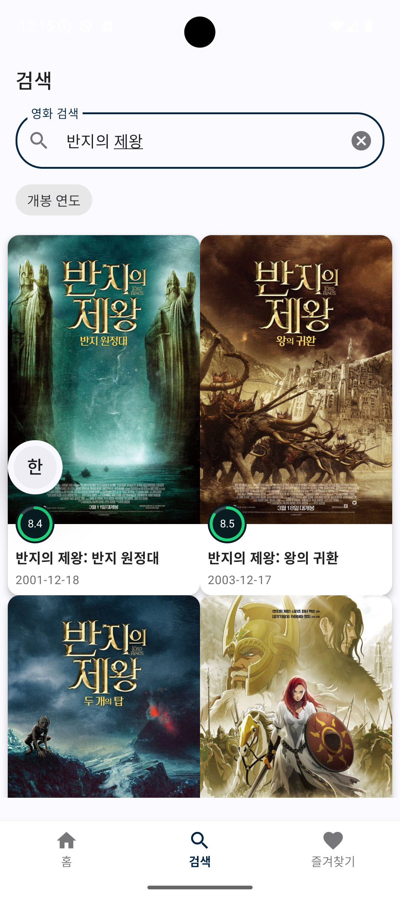
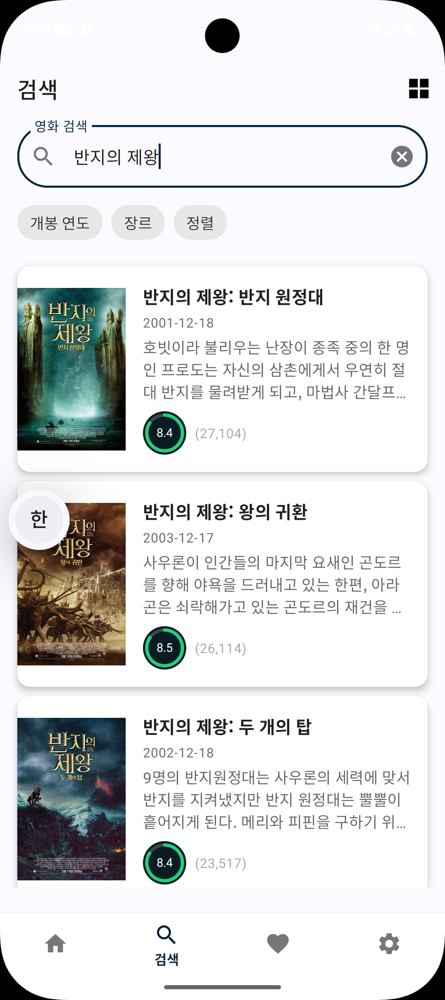
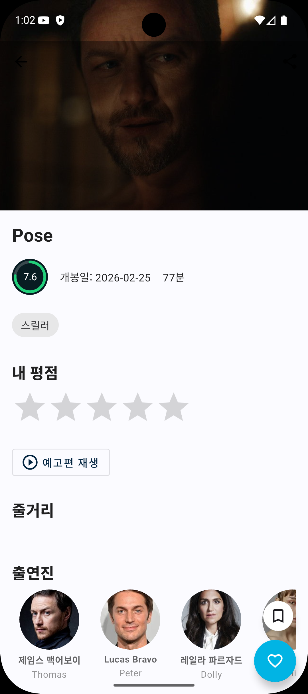
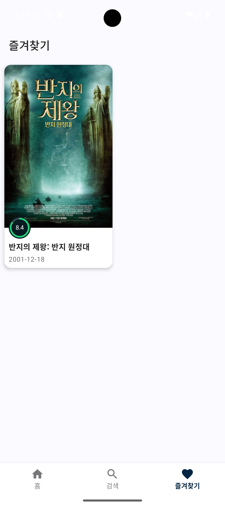
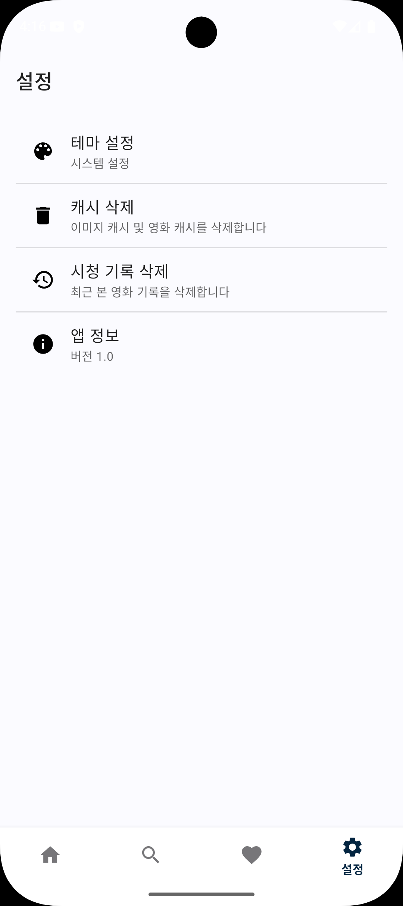

# MovieFinder

TMDB (The Movie Database) API를 활용한 영화 검색 Android 앱입니다.
Clean Architecture + MVVM 패턴 기반으로, 오프라인 캐시, 다크 모드, 페이징, 딥링크 등 실무 수준의 기능을 구현했습니다.

## Screenshots

| Home | Search (Grid) | Search (List) | Detail | Favorite | Settings |
|:----:|:-------------:|:-------------:|:------:|:--------:|:--------:|
|  |  |  |  |  |  |

## Tech Stack

| Category | Stack |
|----------|-------|
| Language | Kotlin 2.2.10 |
| Build | AGP 9.1.0, Gradle 9.3.1, KSP 2.3.2 |
| UI | XML Layouts, ViewBinding, Material Components 1.13.0 |
| Architecture | Clean Architecture, MVVM |
| DI | Hilt 2.59.2 |
| Network | Retrofit 3.0.0, OkHttp 5.0.0-alpha.14, kotlinx.serialization 1.8.1 |
| Database | Room 2.8.4, Typed DataStore 1.2.0 (kotlinx.serialization JSON) |
| Async | Coroutines, Flow, StateFlow, Channel |
| Date/Time | kotlinx-datetime 0.6.2 |
| Paging | Paging 3.4.0, RemoteMediator |
| Image | Coil 3.4.0 (메모리 25% + 디스크 5% 캐시) |
| Navigation | Navigation Component 2.9.7, Safe Args |
| Test | JUnit 4, MockK 1.14.9, Turbine 1.2.1 (145개 유닛 + 5개 Espresso) |
| CI/CD | GitHub Actions (Detekt + Lint + Build + Test) |
| Static Analysis | Detekt 2.0.0-alpha.2 + KtLint |
| Logging | Timber 5.0.1 |
| Notification | WorkManager 2.10.1 (개봉일 알림) |
| Widget | AppWidgetProvider (인기 영화 위젯) |
| i18n | 한국어 (기본) + 영어 |
| Performance | Baseline Profiles, Splash Screen API, App Startup, R8 Full Mode |
| Modern Android | Predictive Back Gesture, Per-App Language, Gradle Convention Plugins |

## Architecture

### Clean Architecture + MVVM

```
API/DB  →  Repository  →  UseCase  →  ViewModel  →  Fragment (XML UI)
```

```
app/src/main/java/com/choo/moviefinder/
├── core/                  # 공유 유틸리티
│   ├── startup/           # App Startup (Timber, StrictMode)
│   └── util/              # ErrorMessageProvider, ImageUrlProvider, NetworkMonitor
├── data/                  # 데이터 레이어
│   ├── local/             # Room DB, DataStore, DAO, Entity
│   ├── paging/            # PagingSource (검색), DiscoverPagingSource (탐색), RemoteMediator (홈)
│   ├── remote/            # Retrofit API Service, DTO
│   ├── repository/        # Repository 구현체
│   └── util/              # 상수 (PAGE_SIZE, PREFETCH_DISTANCE, DEFAULT_PAGING_CONFIG, 언어 코드)
├── domain/                # 도메인 레이어 (순수 Kotlin)
│   ├── model/             # Movie, MovieDetail(toMovie()), Cast, Review, Genre, ThemeMode
│   ├── repository/        # Repository 인터페이스
│   └── usecase/           # UseCase 30개
├── presentation/          # 프레젠테이션 레이어
│   ├── adapter/           # RecyclerView 어댑터 7개 + MovieGridViewHolder + MovieListViewHolder
│   ├── common/            # CircularRatingView (커스텀 뷰), GridLayoutManagerFactory
│   ├── detail/            # 상세 화면 (DetailFragment, DetailViewModel)
│   ├── favorite/          # 즐겨찾기/워치리스트 화면 (TabLayout 탭 전환)
│   ├── home/              # 홈 화면 (시청 기록 포함)
│   ├── search/            # 검색 화면 (장르/정렬 필터)
│   ├── settings/          # 설정 화면 (테마/캐시/시청기록 관리)
│   ├── stats/             # 시청 통계 화면 (총 시청/월별/평균 별점/장르 Top 3)
│   └── widget/            # 홈 화면 위젯 (PopularMoviesWidget)
├── di/                    # Hilt DI 모듈
├── MainActivity.kt        # NavHostFragment + 딥링크 + 네트워크 Snackbar
└── MovieFinderApp.kt      # Application (@HiltAndroidApp, Coil/테마/Certificate Pinning/NotificationChannel)
```

### 레이어 규칙

- **Domain 레이어**: 순수 Kotlin, Android 프레임워크 의존성 없음
- **Data 레이어**: API 통신, DB 접근, Domain Repository 인터페이스 구현
- **Presentation 레이어**: ViewModel + Fragment/XML UI, Domain UseCase에만 의존 (Data 레이어 직접 참조 금지)
- **Core 레이어**: 공유 유틸리티, 모든 레이어에서 접근 가능

## Features

### 1. 홈 화면

- **현재 상영작 / 인기 영화** TabLayout 전환 (화면 회전 시 탭 상태 복원)
- **시청 기록**: 상세 화면 진입 시 자동 저장, 홈 화면 상단 가로 스크롤로 최근 본 영화 20개 표시
- **Paging 3 무한 스크롤** (페이지당 20개, GridLayoutManager 2열)
- **오프라인 지원**: RemoteMediator + Room 캐시 — 네트워크 오류 시에도 캐시 데이터 표시
- **Facebook Shimmer** 로딩 애니메이션
- **RecyclerView 아이템 애니메이션**: staggered slide-up layoutAnimation
- **맨 위로 FAB**: 스크롤 시 mini FAB 표시 → 탭하면 최상단 이동

### 2. 검색 화면

- **300ms debounce** 적용 실시간 검색 + 즉시 검색 (`merge(debounced, immediate)` → `flatMapLatest`)
- **고급 필터**: 연도 / 장르 다중 선택 (3개 이상 시 카운트 표시, 로드 실패 시 Snackbar 재시도) / 정렬 (인기순·평점순·개봉일순·수익순) ChipGroup
- **Discover 모드**: 검색어 없이 장르/정렬 필터만으로 영화 탐색 (TMDB Discover API)
- **SavedStateHandle**: 검색어 + 연도 필터 프로세스 사망 시 자동 복원
- **최근 검색어** Room DB 저장/삭제/전체삭제 (타임스탬프 인덱스 최적화)
- 상태별 UI 전환 (초기/검색중/결과없음/결과표시)
- **검색 추천**: 결과 없을 때 추천 검색어 칩 (마블, 스파이더맨, 배트맨, 스타워즈, 해리포터)
- **보기 모드 전환**: Toolbar 메뉴 토글로 그리드 ↔ 리스트 뷰 전환 (SavedStateHandle 저장)
- **맨 위로 FAB**: 스크롤 시 mini FAB 표시

### 3. 영화 상세 화면

- **CoordinatorLayout + CollapsingToolbarLayout** 패럴랙스 배경 이미지
- **영화 리뷰**: TMDB reviews API로 사용자 리뷰 표시 (클릭 시 확장/축소)
- 상세/출연진/비슷한 영화/예고편/등급/리뷰 **6개 API 병렬 호출** (`coroutineScope` + `async`)
- **확장 상세 정보**: 제작비, 수익, 원어, 상태, IMDb 링크
- **콘텐츠 등급 배지**: release_dates API로 KR→US 폴백 등급 Chip 표시
- **영화 공유**: Toolbar 메뉴에서 Intent.ACTION_SEND (제목, 개봉일, 줄거리, TMDB 링크)
- **부분 실패 처리**: 출연진/비슷한 영화/예고편/등급 API 실패 시 빈 리스트/null로 대체 (Timber 로깅)
- **중복 호출 방지**: `Mutex.tryLock()` 기반 원자적 로딩 가드로 중복 API 호출 차단 (에러 후 재시도 가능), FAB 연타 방지 `toggleMutex.withLock()`
- **출연진 정렬**: `order` 필드 기준 오름차순 정렬
- **사용자 평점**: RatingBar로 0.5~5.0 별점 매기기 (Room DB 저장), 삭제 버튼으로 평점 초기화
- **ChipGroup**으로 장르 칩 동적 추가
- **FAB 즐겨찾기/워치리스트 토글**: `@Transaction` 원자적 처리 + bounce 애니메이션 (연타 스태킹 방지) + `toggleMutex.withLock()` 동시 실행 방지 + 실패 시 Channel(CONFLATED) → Snackbar 피드백
- **예고편 재생**: TMDB Videos API → YouTube 앱/웹 브라우저 연결
- **Shared Element Transition**: 홈/검색/즐겨찾기 → 상세 화면 포스터 이미지 공유 전환

### 4. 즐겨찾기 / 워치리스트 화면

- **TabLayout**: 즐겨찾기 / 보고 싶은 영화 탭 전환 (탭 상태 저장)
- **Room Flow** 기반 실시간 업데이트 (`repeatOnLifecycle`)
- **스와이프 삭제**: 양쪽 탭 모두 ItemTouchHelper 왼쪽 스와이프 + Snackbar 실행취소 (Undo)
- **토글 에러 처리**: DB 에러 시 앱 크래시 방지 (try-catch + Timber 로깅)
- 빈 상태 UI (탭별 다른 아이콘/메시지)

### 5. 설정 화면

- **테마 설정**: 라이트/다크/시스템 전환 (Typed DataStore 저장)
- **언어 설정**: 한국어/영어/시스템 전환 (Per-App Language, `AppCompatDelegate.setApplicationLocales()`)
- **시청 통계**: Settings → StatsFragment 네비게이션
- **캐시 삭제**: Coil 이미지 메모리 + 디스크 캐시 클리어
- **시청 기록 삭제**: Room DB 시청 기록 전체 삭제
- **앱 정보**: 버전 표시 (BuildConfig)
- **에러 처리**: 설정 변경 실패 시 앱 크래시 방지 (try-catch + CancellationException rethrow)
- BottomNavigationView 4번째 탭

### 5-1. 시청 통계 화면

- **총 시청 편수 / 이번 달 시청 편수**: WatchHistoryDao Flow 기반 실시간 갱신
- **내 평균 별점**: UserRatingDao AVG 쿼리 (평점 없을 시 안내 텍스트)
- **장르 Top 3**: WatchHistoryEntity genres 필드 → 빈도 계산
- **stateIn 패턴**: Room Flow 자동 갱신, retry 불필요
- 4개 MaterialCardView 카드 UI

### 6. 홈 화면 위젯
- **인기 영화 Top 10** 목록 위젯 (AppWidgetProvider + RemoteViewsService)
- 1시간 주기 자동 갱신 + 수동 새로고침 버튼
- 영화 클릭 → 딥링크로 상세 화면 이동
- 다크 모드 대응 배경

### 7. 개봉일 알림
- 워치리스트에 영화 추가 시 **개봉일 당일 오전 9시 알림** 예약 (WorkManager)
- 워치리스트에서 제거 시 알림 자동 취소
- 알림 탭 → 영화 상세 화면 딥링크 연동

### 8. 다국어 지원
- **한국어** (기본) + **영어** (168개 문자열 완전 번역)

### 9. 딥링크

- **커스텀 스킴**: `moviefinder://movie/{movieId}` (Navigation Component 자동 처리)
- **TMDB 웹 URL**: `https://www.themoviedb.org/movie/{movieId}` (MainActivity에서 수동 파싱)

### 10. 최신 Android 기술

- **Predictive Back Gesture**: Android 14+ 뒤로가기 미리보기 애니메이션 (`enableOnBackInvokedCallback`)
- **Per-App Language**: 앱 내 언어 전환 (시스템 설정 연동, `locales_config.xml`)
- **kotlinx-datetime**: Calendar/SimpleDateFormat 대체 멀티플랫폼 날짜/시간 API
- **Typed DataStore**: Preferences → kotlinx.serialization JSON 기반 타입 안전 설정 저장
- **Gradle Convention Plugins**: `buildSrc/AndroidConfig` 공유 빌드 상수
- **R8 Full Mode**: 최적화 강화 + ProGuard 규칙 보강

## 핵심 구현 상세

### 오프라인 지원 (RemoteMediator 패턴)

홈 화면의 현재 상영작/인기 영화는 Room DB를 Single Source of Truth로 사용합니다.

```
[온라인] API → RemoteMediator → Room 캐시 저장 → Room PagingSource → UI
[오프라인] Room 캐시 데이터 즉시 표시 (네트워크 오류 시에도 기존 데이터 유지)
```

- `CachedMovieEntity`: 복합 PK(`id` + `category`), 카테고리별 인덱스
- `RemoteKeyEntity`: 페이징 키 추적 + `lastUpdated` 타임스탬프
- `WatchHistoryEntity`: 시청 기록 (최근 20개, watchedAt 인덱스)
- `WatchlistEntity`: 워치리스트 (addedAt 인덱스)
- `UserRatingEntity`: 사용자 영화 평점 (PK: movieId)
- `MovieRemoteMediator`: API → Room 동기화, **`withTransaction`으로 원자적 캐시 갱신**, **1시간 캐시 만료** (`initialize()`에서 체크)
- 검색은 네트워크 전용 (`MoviePagingSource`)

### 에러 처리 구조

ViewModel이 Android Context에 의존하지 않도록 에러 타입을 분리했습니다.

```
예외 발생 → ErrorMessageProvider.getErrorType() → ErrorType (NETWORK/TIMEOUT/SERVER/SSL/PARSE/UNKNOWN)
         → ViewModel: ErrorType만 보유 (Context 불필요)
         → Fragment: ErrorMessageProvider.getMessage(context, errorType) → 한국어 메시지 표시
```

- `CancellationException`은 catch하지 않고 rethrow (코루틴 취소 시 잘못된 에러 상태 방지)
- HomeFragment/MovieLoadStateAdapter 등 View 레이어에서는 기존 `getErrorMessage(context, throwable)` 사용

### 네트워크 보안

- **Certificate Pinning**: `api.themoviedb.org` + `image.tmdb.org` leaf + intermediate SHA-256 핀 (OkHttp `CertificatePinner`, Coil에 `@ImageOkHttpClient` 주입)
- **Network Security Config**: `cleartextTrafficPermitted="false"` (HTTPS 강제)
- **API Key**: `local.properties` → `BuildConfig` 주입, OkHttp Interceptor로 모든 요청에 자동 추가

### 다크 모드

- `Theme.MaterialComponents.DayNight.NoActionBar` 기반
- `values-night/colors.xml`에 다크 모드 전용 색상 정의
- 11개 아이콘 drawable: `android:fillColor="@color/icon_default"` (라이트: 검정, 다크: 흰색)
- Typed DataStore(`DataStore<UserSettings>`)에 테마 설정 저장, `MovieFinderApp.onCreate()`에서 `runBlocking`으로 초기 테마 동기 적용 (깜빡임 방지)
- `ProcessLifecycleOwner`로 이후 테마 변경 실시간 반영

### 이미지 캐시 (Coil 3)

- 메모리 캐시: 앱 메모리의 25%
- 디스크 캐시: 디스크의 5%
- `ImageUrlProvider`를 통해 이미지 URL 중앙 관리 (`posterUrl`, `backdropUrl`, `profileUrl`)
- `@ImageOkHttpClient`로 `image.tmdb.org` Certificate Pinning 적용
- 모든 이미지 어댑터에서 `onViewRecycled()` 시 `dispose()` 호출하여 메모리 최적화

### Shared Element Transition

```
FragmentNavigatorExtras(posterView to "poster_$movieId")
  → DetailFragment: postponeEnterTransition(500ms timeout) + Coil listener(onSuccess, onError) { startPostponedEnterTransition() }
  → TransitionSet: ChangeBounds + ChangeTransform + ChangeImageTransform
```

## Testing

총 **145개** 유닛 테스트 + **5개** Espresso UI 테스트를 작성하여 핵심 비즈니스 로직을 검증합니다.

```bash
./gradlew testDebugUnitTest
```

| 테스트 클래스 | 테스트 수 | 대상 |
|---|---|---|
| `MovieRepositoryImplTest` | 36 | 영화 상세, 출연진, 비슷한 영화, 예고편 키(5개), 즐겨찾기 DAO 위임/조회, 검색 기록 CRUD, 인증등급(4개), 장르(1개), 시청기록(3개), 워치리스트(4개), 리뷰(2개), 사용자 평점(3개) |
| `DetailViewModelTest` | 24 | 초기 상태, ErrorType 에러, 부분 실패(credits/similar/trailer/reviews), 즐겨찾기/워치리스트 토글, Snackbar, 재시도, 중복 호출 방지, 인증등급/리뷰 로드, 알림 스케줄/취소, 사용자 평점 설정/삭제/에러/조회(5개) |
| `SearchViewModelTest` | 27 | 검색어 변경, 검색 저장, 빈 검색어, 삭제, 전체 삭제, 최근 검색어, 연도 필터, SavedStateHandle 복원, 장르 선택/초기화, 정렬 선택/초기값, SortOption 매핑, 뷰모드 토글(4개), Discover 필터(1개), 장르 재시도(2개) |
| `ErrorMessageProviderTest` | 10 | 예외 타입별 ErrorType 매핑 (Network, Timeout, Server, SSL, Parse, IOException, Unknown) |
| `SettingsViewModelTest` | 10 | 테마 기본값/DARK/LIGHT 반영, 테마 설정(2개), 테마 설정 에러 처리, 시청기록 삭제/에러, 성공/에러 이벤트 |
| `FavoriteViewModelTest` | 10 | 즐겨찾기 목록, 빈 목록, 토글, 토글 에러, 워치리스트 목록/토글, 정렬(추가날짜/제목/평점) |
| `HomeViewModelTest` | 5 | UseCase 호출 검증 (nowPlaying, popular, 동시 호출), 시청기록 목록, 시청기록 빈 목록 |
| `PreferencesRepositoryImplTest` | 4 | 테마 기본값, DARK/LIGHT 저장, 테마 변경 (실제 DataStore 사용) |
| `MoviePagingSourceTest` | 7 | 검색 PagingSource: refresh/append/error/year 파라미터/null 키 |
| `DiscoverPagingSourceTest` | 5 | Discover PagingSource: refresh/error/파라미터 검증/last page/append |
| `MovieRemoteMediatorTest` | 7 | RemoteMediator: initialize (캐시없음/만료/유효), PREPEND/APPEND/API 에러 |

### 테스트 패턴

- **MockK**: UseCase/Repository/DAO/API 모킹
- **Turbine**: StateFlow/SharedFlow 수집 및 검증
- **StandardTestDispatcher** + `Dispatchers.setMain()`: 코루틴 테스트
- **DataStoreFactory**: 실제 Typed DataStore를 사용한 통합 테스트

## CI/CD

### GitHub Actions (`.github/workflows/android-ci.yml`)

- **트리거**: `push` / `pull_request` → `main` 브랜치
- **빌드 환경**: Ubuntu + JDK 21 (Temurin) + Gradle 캐시
- **파이프라인**: Detekt → Lint → Debug Build → Unit Test → JaCoCo 리포트
- **Artifact**: Lint 결과 HTML + 테스트 결과 HTML + Detekt 결과 + JaCoCo 커버리지 리포트 + Debug APK 업로드
- **Concurrency**: 동일 브랜치 중복 실행 시 이전 실행 자동 취소

### 정적 분석

```bash
./gradlew :app:detekt          # Detekt + KtLint 규칙
./gradlew jacocoTestReport     # 커버리지 리포트 (app/build/reports/jacoco/)
```

## 성능 최적화

- **Baseline Profiles**: `ProfileInstaller` + `:baselineprofile` 모듈로 앱 시작 성능 최적화
- **App Startup**: `TimberInitializer`로 초기화 최적화, `StrictModeInitializer`는 디버그 빌드에서만 등록
- **Coil 이미지 캐시**: 메모리 25% + 디스크 5% (네트워크 요청 최소화) + `onViewRecycled()` dispose + 설정에서 메모리/디스크 캐시 동시 클리어
- **Paging 3**: 페이지 단위 로딩, `prefetchDistance=5`, `initialLoadSize=PAGE_SIZE` 최적화
- **RemoteMediator 캐시 만료**: 1시간 경과 시 자동 새로고침 (`initialize()` + `lastUpdated` 타임스탬프)
- **Room 인덱스**: `CachedMovieEntity(category)`, `FavoriteMovieEntity(addedAt)`, `RecentSearchEntity(timestamp)`, `WatchHistoryEntity(watchedAt)`, `WatchlistEntity(addedAt)` 인덱스 추가
- **CircularRatingView**: `onSizeChanged()`에서 draw 메트릭 캐싱 (매 프레임 재계산 방지)
- **Shimmer 생명주기**: `onDestroyView()`에서 `stopShimmer()` 호출하여 CPU/배터리 절약
- **R8 Full Mode**: `android.enableR8.fullMode=true`로 최적화 강화 (ProGuard 규칙 보강)
- **Gradle Configuration Cache**: 반복 빌드 속도 개선
- **Gradle Convention Plugins**: `buildSrc/AndroidConfig` 공유 빌드 상수 (compileSdk, minSdk, targetSdk 중앙 관리)
- **HttpLoggingInterceptor**: 릴리스 빌드에서 객체 자체를 미생성하여 오버헤드 제거

## 코드 품질

### 코드 중복 제거
- **PagingConfig 상수 추출**: `DEFAULT_PAGING_CONFIG`로 4곳 중복 제거
- **GridLayoutManager 헬퍼**: `createMovieGridLayoutManager()`로 HomeFragment + SearchFragment 중복 제거
- **HorizontalMovieAdapter 통합**: SimilarMovieAdapter + WatchHistoryAdapter → `transitionPrefix` 파라미터로 1개 어댑터로 통합
- **bindOptionalField 헬퍼**: DetailFragment 확장 정보 바인딩 반복 패턴 간략화
- **MovieGridViewHolder 공유**: MoviePagingAdapter + MovieAdapter가 동일한 ViewHolder 사용
- **MovieListViewHolder**: 리스트 뷰 모드용 ViewHolder (포스터 + 제목 + 줄거리 + 평점 + 투표수)

### 안정성
- **FAB 애니메이션 스태킹 방지**: `animate().cancel()` + scale 리셋으로 연타 시 겹침 방지
- **SettingsViewModel 에러 처리**: setThemeMode/clearWatchHistory에 try-catch + CancellationException rethrow
- **장르 로드 실패 피드백**: Snackbar + retryLoadGenres() 재시도
- **FavoriteFragment 탭 전환**: `submitList(emptyList())`로 stale data 방지
- **장르 칩 오버플로우**: 3개 이상 선택 시 "장르 N개" 카운트 표시
- **WATCH_HISTORY_LIMIT 상수 추출**: WatchHistoryDao 파라미터화로 매직 넘버 제거
- **검색어 저장 trim 순서 수정**: `trim()` 후 `isNotBlank()` 검증 (공백 쿼리 방어)
- **딥링크 movieId 검증 강화**: 음수/0 ID 네비게이션 차단
- **캐시 삭제 안정성**: `try-finally`로 memoryCache 실패해도 diskCache 클리어 보장
- **DetailViewModel 보일러플레이트 제거**: `launchWithSnackbar` 헬퍼로 중복 try-catch 통합
- **위젯 리소스 누수 수정**: OkHttp `response.use {}` 패턴으로 Response 자동 닫힘 보장
- **시청 통계 화면**: 총 시청/이번 달/평균 별점/장르 Top 3 (stateIn + combine 패턴, Room DB v10)
- **MovieDetail.toMovie()**: ViewModel private 확장 함수 → 도메인 모델 멤버 함수로 이동 (재사용성 향상)
- **saveWatchHistory 분리**: `coroutineScope` 밖으로 이동하여 시청 기록 저장 실패가 UI 상태에 영향 주지 않도록 구조적 분리
- **FAB 연타 방어**: `toggleMutex.withLock()`으로 즐겨찾기/워치리스트 동시 실행 방지
- **Channel.CONFLATED**: 스낵바 이벤트 채널을 BUFFERED(64) → CONFLATED로 축소 (최신 이벤트만 유지)

## Setup

### 1. API Key 발급

[TMDB](https://www.themoviedb.org/settings/api)에서 API 키를 발급받습니다.

### 2. local.properties 설정

```properties
TMDB_API_KEY=your_api_key_here
```

### 3. 빌드

```bash
./gradlew assembleDebug
```

### 4. 딥링크 테스트 (adb)

```bash
# 커스텀 스킴
adb shell am start -a android.intent.action.VIEW -d "moviefinder://movie/550"

# TMDB 웹 URL
adb shell am start -a android.intent.action.VIEW -d "https://www.themoviedb.org/movie/550"
```

### GitHub Secrets (CI/CD)

Repository Settings > Secrets and variables > Actions:
- `TMDB_API_KEY`: TMDB API 키 값

## Requirements

- Android Studio (AGP 9.1.0+)
- JDK 21+
- minSdk 24 / targetSdk 36

## License

MIT License