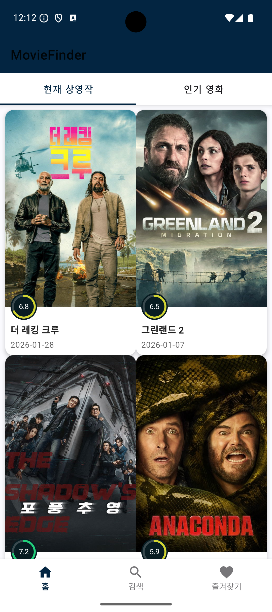
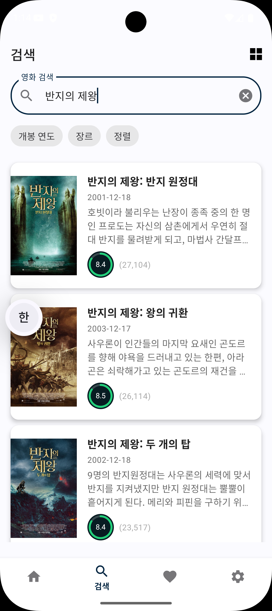
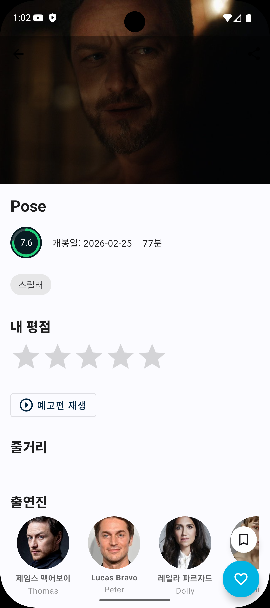
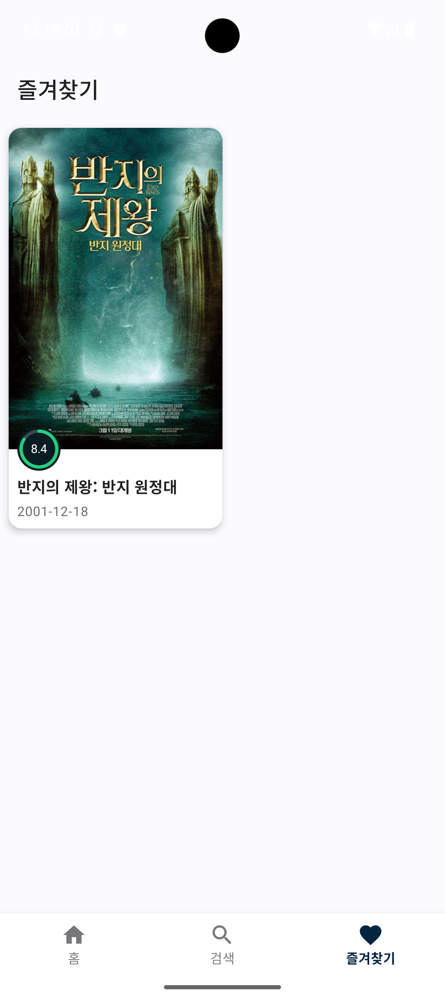
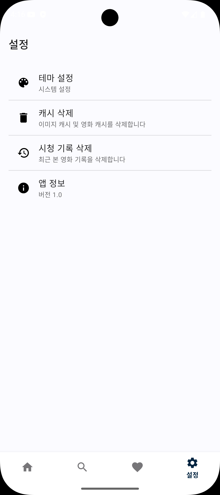

# MovieFinder

> TMDB API를 활용한 영화 검색 Android 앱


Clean Architecture + MVVM 패턴 기반으로, 오프라인 캐시, 다크 모드, 페이징, 딥링크 등 실무 수준의 기능을 구현했습니다.

---

## 🤖 AI 활용 하이라이트

이 프로젝트는 단순한 앱이 아니라, **AI 기반 개발 워크플로우**를 직접 실험한 결과물입니다.

| 실험 내용 | 도구 | Before | After |
|---|---|---|---|
| 시청 통계 기능 전체 설계 및 구현 | Claude Code | 기능 없음 | UseCase 49개, Repository 11개 인터페이스 |
| PR 코드 리뷰 자동화 | GitHub Actions + Claude API | 수동 리뷰 | PR 생성 시 자동 리뷰 코멘트 게시 |
| 테스트 커버리지 개선 | Claude Code + JaCoCo | 미측정 (0%) | Line **75%** / Branch **70%** 달성 |
| 유닛 테스트 작성 | Claude Code | 0개 | **856개** 자동 작성 |
| 라이브러리 보안 취약점 분석 | Exa MCP | 미점검 | 실시간 웹 검색으로 실제 버그 발견 |
| think / ultra think 프롬프트 비교 | Claude Code | 단일 분석 | 4에이전트 병렬, **30개+ 이슈** 자동 발견 |

📂 실험 전체 기록: [AI-dev-notes](https://github.com/ChooJeongHo/AI-dev-notes)
---

## Screenshots

| Home | Search (Grid) | Search (List) | Detail | Favorite | Settings |
|:----:|:-------------:|:-------------:|:------:|:--------:|:--------:|
|  |  |  |  |  |  |

---

## Tech Stack

| Category | Stack |
|----------|-------|
| Language | Kotlin 2.3.21 |
| Build | AGP 9.4.0, Gradle 9.7.1, KSP 2.3.12 |
| UI | XML Layouts + ViewBinding (대부분 화면), Jetpack Compose(검색 결과 화면 일부 + 온보딩 화면), Jetpack Glance(박스오피스 위젯), Material Components 1.14.0 |
| Architecture | Clean Architecture, MVVM |
| DI | Hilt 2.60.1 |
| Network | Retrofit 3.0.0, OkHttp 5.5.0, kotlinx.serialization 1.11.0 |
| Database | Room 2.8.5, Typed DataStore 1.2.1 |
| Async | Coroutines, Flow, StateFlow, Channel |
| Paging | Paging 3.5.1, RemoteMediator |
| Image | Coil 3.6.2 |
| Navigation | Navigation Component 2.10.1, Safe Args |
| Security | Certificate Pinning (OkHttp), EncryptedSharedPreferences |
| Background | WorkManager 2.11.2 |
| Test | JUnit 4, MockK 1.14.11, Turbine 1.2.1 (856개 유닛 + 29개 Espresso) |
| CI/CD | GitHub Actions (Build / Test / Coverage / Cert Pinning / Claude 자동 리뷰 / Auto-merge) |
| Static Analysis | Detekt 2.0.0-alpha.6 + KtLint |

---

## Architecture

```
API/DB  →  Repository  →  UseCase  →  ViewModel  →  Fragment (XML UI, 검색 결과는 Compose)
```

```
app/src/main/java/com/choo/moviefinder/
├── core/           # 공유 유틸리티 (ErrorMessageProvider, NetworkMonitor, 알림)
├── data/           # 데이터 레이어 (Room, Retrofit, PagingSource, RemoteMediator)
├── domain/         # 도메인 레이어 (Model, Repository 인터페이스, UseCase 49개)
├── presentation/   # 프레젠테이션 레이어 (Fragment, ViewModel, Adapter)
├── di/             # Hilt DI 모듈
├── MainActivity.kt
└── MovieFinderApp.kt
```

| 레이어 | 규칙 |
|--------|------|
| Domain | 순수 Kotlin, Android 프레임워크 의존성 없음 |
| Repository | ISP 원칙 기반 도메인별 분리 (11개 인터페이스) |
| Presentation | Domain UseCase에만 의존, Data 레이어 직접 참조 금지 |

---

## Features

| 화면 | 주요 기능 |
|------|-----------|
| 홈 | 현재 상영작 / 인기 영화 / 트렌딩 탭, Paging 3 무한 스크롤, 오프라인 캐시 (RemoteMediator), 최근 본 영화, KOFIC 일별·주간 박스오피스 TOP 10 (TMDB 매칭, KMRB 관람등급 배지) |
| 검색 | 실시간 검색 (debounce), 연도 / 장르 / 정렬 / KMRB 관람등급 필터, Discover 모드, 그리드 ↔ 리스트 전환, 배우 검색 |
| 영화 상세 | 출연진 / 추천 영화 / 리뷰 / 예고편 (YouTube 연결), 즐겨찾기 / 워치리스트, 내 평점, 메모, 스트리밍 정보, KMRB 국내 관람등급, Shared Element Transition |
| 배우 상세 | 프로필, 바이오그래피, 필모그래피 |
| 시리즈 | 영화 컬렉션 (시리즈) 조회 |
| 즐겨찾기 | 즐겨찾기 / 워치리스트 탭, 스와이프 삭제 + Undo, 정렬, 태그, 워치리스트 개봉일 알림 |
| 설정 | 테마 / 언어 전환, 시청 목표, 데이터 백업 (JSON), TMDB 계정 연결 |
| 통계 | 시청 편수, 평균 별점, 장르 파이차트, 월별 바차트, 평점 히스토그램, 캘린더 히트맵 |
| 온보딩 | 첫 실행 시 3페이지 온보딩 화면 |
| 알림 이력 | 예약된 개봉일 알림 목록 조회 및 취소 |

**기타**
- 홈 화면 위젯 2종: 인기 영화 Top 10(RemoteViewsService, 1시간 자동 갱신), 박스오피스(Jetpack Glance)
- App Shortcuts: 검색 / 즐겨찾기 정적 단축키 + 최근 시청 영화 동적 단축키
- 개봉일 알림 / 시청 목표 달성 알림 (WorkManager)
- 딥링크: `moviefinder://movie/{id}`, `moviefinder://person/{id}`, `moviefinder://stats`
- 한국어 + 영어 다국어 지원 (Per-App Language)
- Baseline Profiles
- Predictive Back Gesture (Fragment 전환 스크러빙 미리보기)

---

## Testing

유닛 테스트 **856개** + Espresso UI 테스트 **29개** | Line Coverage **75%** | Branch Coverage **70%**

```bash
# 유닛 테스트
./gradlew testDebugUnitTest

# UI 테스트 (에뮬레이터/실기기 필요)
./gradlew connectedDebugAndroidTest

# 커버리지 리포트 (최소 50% 기준)
./gradlew jacocoTestReport
```

---

## CI/CD

| 워크플로우 | 트리거 | 내용 |
|-----------|--------|------|
| `android-ci.yml` | push / PR → main | Detekt → Lint → Build → Test → JaCoCo |
| `cert-pin-check.yml` | 매주 월요일 | 인증서 핀 검증, 불일치 시 Issue 생성 |
| `pr-coverage.yml` | PR → main | 커버리지 리포트 PR 코멘트 자동 게시 |
| `claude-code-review.yml` / `claude-pr-review.yml` | PR open/synchronize | Claude 기반 자동 코드 리뷰 코멘트 |
| `claude.yml` | 이슈/PR 코멘트 | `@claude` 멘션 시 Claude Code 응답 |
| `auto-merge.yml` | PR | 조건 충족 시 자동 병합 |
| `release.yml` | `v*.*.*` 태그 push | 릴리즈 자동화 |
| Pre-commit Hook | git commit | Detekt + 컴파일 체크 |
| Pre-push Hook | git push | 유닛 테스트 전체 실행 |

---

## Setup

### 1. API Key 발급

- [TMDB](https://www.themoviedb.org/settings/api) — 필수, 앱 전체 기능에 필요
- [KOFIC 영화진흥위원회 Open API](https://www.kobis.or.kr/kobisopenapi/) — 선택, 홈 화면 박스오피스 기능에 필요
- [KMRB 영상물등급위원회 Open API](https://www.data.go.kr/data/15057639/openapi.do) — 선택, 국내 관람등급 표시/필터 기능에 필요

### 2. local.properties 설정

```properties
TMDB_API_KEY=your_tmdb_api_key
KOFIC_API_KEY=your_kofic_api_key       # 선택 - 박스오피스 기능
KOFB_API_KEY=your_kmrb_api_key         # 선택 - KMRB 관람등급 기능 (키 이름은 KOFB_API_KEY)
```

> `tools/codebase-rag`(개발용 RAG 검색 도구)는 `ANTHROPIC_API_KEY`/`VOYAGE_API_KEY`를 별도로 사용하지만, 앱 빌드에는 영향 없음.

### 3. 빌드

```bash
./gradlew assembleDebug
```

### 4. 딥링크 테스트 (adb)

```bash
adb shell am start -a android.intent.action.VIEW -d "moviefinder://movie/550"
adb shell am start -a android.intent.action.VIEW -d "moviefinder://person/6193"
adb shell am start -a android.intent.action.VIEW -d "moviefinder://stats"
```

> CI/CD 사용 시 GitHub Secrets에 `TMDB_API_KEY` 등록 필요

---

## Requirements

- Android Studio (AGP 9.4.0+)
- JDK 21+
- compileSdk 37 / minSdk 24 / targetSdk 36

## License

MIT License
